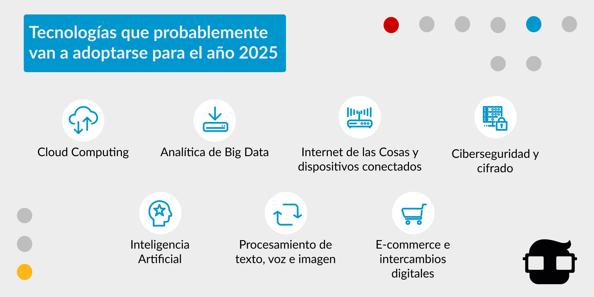

Mira a tu alrededor y trata de identificar los dispositivos electrónicos, son elementos que requieren de programación para funcionar, tu computador, tu TV, tu celular, el router, etc. Porque la tecnología va más allá de enlazar el entorno humano, natural y social, más allá de una simple computadora, de un teléfono o de un videojuego.

Desde el siglo XV, empiezan a aparecer las primeras máquinas, dentro de las cuales están incluidas las computadoras, que tienen como proceso base: la programación, un proceso que involucra codificación, diseño, mantenimiento y protección de programas.

Desde entonces, no han parado los avances en tecnología y la programación ha sido clave en ello, por eso hoy te contamos cuatro razones de por qué la programación es tan importante en nuestras vidas.

## La programación es omnipresente

En la actualidad no hay una industria en la que la programación no esté presente, pues ha contribuido a desarrollar elementos, para responder a millones de necesidades de la vida cotidiana. Por ejemplo, los automóviles tienen procesos donde se involucra el código, el tráfico aéreo, un semáforo, un videojuego, Netflix, hasta una cafetera inteligente.

Y es que vale la pena hacer un repaso sobre la evolución de la programación:

- Ada Lovelace, fue la primera programadora de la historia (1815 - 1852)
- Konrad Zuse, inventó la primera computadora programable conocida como Z1 (1936)
- Se inventa el microchip en 1960, lo cual permitió hacer computadoras más pequeñas.
- Se crea el primer lenguaje de programación de la historia por IBM, llamado Fortran, en 1957.

Desde la década del 50 hasta la actualidad han transcurrido más de 60 años, en los que la tecnología solo se multiplicó, pero esta línea de tiempo solo evidencia cómo la programación fue clave para eso.

## La programación genera empleos

Según [Forbes](https://www.forbes.com/sites/cognitiveworld/2020/02/26/future-of-work-we-cant-all-becomecoders/?sh=27645a47cb8f), el mercado de los Bootcamp creció un 49% entre 2018 y 2019 y es que en los últimos años, también ha crecido la demanda de empleos en el sector tecnológico, donde la programación tiene gran presencia. De hecho, en palabras de Ramiro Luz, director de Soluciones de Talento para LinkedIn Hispanoamérica, para una entrevista a [BBC](https://www.bbc.com/mundo/noticias-56247281), uno de los empleos más demandados en las mayores economías de América Latina es el de Desarrollador web "front-end y back-end".

Para demostrar el punto anterior, veamos el top de los skills que necesitarán los empleados para el 2025, según el [Reporte del Futuro de los Trabajos (2020](http://www3.weforum.org/docs/WEF_Future_of_Jobs_2020.pdf)):

1) Pensamiento analítico e innovación

2) Aprendizaje continuo

3) Resolución de problemas complejos

4) Pensamiento crítico y análisis

5) Creatividad, originalidad e iniciativa.

6) Liderazgo e influencia social

7) Uso, monitoreo y control de tecnologías.

8) Diseño de tecnología y programación.

9) Resiliencia, tolerancia al estrés y flexibilidad.

10) Razonamiento

## Necesitamos de la programación para seguir avanzando

Analizando los datos anteriores, podemos ver que la programación no ha terminado de sorprendernos y de ayudarnos. Está en todo, así que la necesitamos para seguir desarrollando tecnologías.

*Algunas de las áreas de la programación que seguirán siendo imprescindibles a futuro:*

**Desarrollo web:** Imprescindible para el desarrollo de sitios y aplicaciones web.

**Desarrollo móvil:** La apps móviles cada vez más importantes, ya que mucha de la información que manejamos está centralizada en nuestros celulares.

**Videojuegos:** Una industria que comenzó en la década de los 50 con el primer videojuego y no ha hecho sino crecer, tan solo en el año 2020 facturó más que el cine y el deporte juntos, según [as.com](https://as.com/meristation/2020/12/26/noticias/1608992024_963325.html)

**Realidad virtual y aumentada:** Esta tecnología se puede trabajar con varios lenguajes, tales como C#, Java, Javascript, Python, entre otros.

**Diseño de aplicaciones de escritorio:** Programas como la suite de Adobe, Office, un editor de código, entre otros.

**Sistemas operativos y sistemas embebidos:** Tanto de computadoras como de dispositivos móviles.

**Seguridad informática:** Python es el lenguaje de programación principal para esta área de seguridad.

**Machine learning:** Donde un programador tiene la importante tarea de crear los modelos.

**Cloud computing:** Los servicios de almacenamiento mundiales que ponen la información a disposición cuando la necesites.

Ahora vale la pena contrastar las áreas de la programación y su omnipresencia versus las tecnologías que probablemente van a adoptarse para el año 2025, según el [Reporte del Futuro de los Trabajos (2020](http://www3.weforum.org/docs/WEF_Future_of_Jobs_2020.pdf)):

## La programación para un futuro sostenible

Por último, pero no menos importante, la programación quizás sea la clave para desarrollar nuevas tecnologías que nos ayuden a frenar el cambio climático. No es un secreto que la misma tecnología genera emisiones de CO2, pero ya hay iniciativas trabajando para que incluso la programación sea más amigable con el medio ambiente, hablamos del Green Coding.

El Green Coding es una nueva tendencia que se refiere a escribir código que produzca algoritmos que tengan el mínimo consumo posible, al optimizar elementos como el espacio en la memoria RAM y procesadores. Ya está demostrado que algunos lenguajes de programación generan mayor impacto ambiental que otros. Uno de los ejemplos de optimización, señalado en el informe [Cambio climático: ¡Cómo el GreenCoding hace la diferencia!](https://www.gft.com/int/en/index/discovery/thought-leadership/climate-change-how-greencoding-makes-a-difference/) es:

*“Un buen ejemplo de cómo incluso un pequeño ahorro de tiempo puede tener un gran impacto, podría ser la optimización del tiempo de inicio de una aplicación bancaria virtual utilizada por 500.000 clientes. Sustituyendo las imágenes de la pantalla de carga y reduciendo su resolución, los tiempos de apertura pueden reducirse, incluso en un milisegundo. Suponiendo que el usuario promedio abre la aplicación al menos una vez al día, esto podría ahorrar más de 50 horas (¡o más de 2 días!) de tiempo de funcionamiento en los dispositivos móviles al año.”*

¿Ahora qué nos depara la programación en el futuro? Podemos darnos cuenta de que simplemente sin programación, las computadoras y el internet no existen, ya que la programación es la base de la tecnología de la Cuarta Revolución Industrial.

Mientras haya programación, seguirá habiendo videojuegos para entretenernos, seguirá habiendo avances médicos y automatización de servicios para la salud, seguirá el desarrollo de robots que en el futuro nos ayuden en las labores domésticas. Así de fundamental es la programación y por eso en 4Geeks Academy queremos que más y más personas se sumen a [aprender en nuestro Bootcamp](https://4geeksacademy.com/es/geeks-vs-otros), que se gradúen en Desarrollo Web Full-Stack, para responder a la demanda de empleos que va en aumento. Conoce más en nuestra página web [aquí](https://4geeksacademy.com/es/inicio/?lang=es).

Síguenos también en RRSS para ver más información sobre programación y tecnología: [Facebook](https://www.facebook.com/4GeeksAcademyCL), [Instagram](https://www.instagram.com/4geeksacademycl/), [LinkedIn](https://www.linkedin.com/school/4geeks-academy-latam/), [Twitter](https://twitter.com/4geeksacademycl), [YouTube](https://www.youtube.com/c/4GeeksAcademy).
