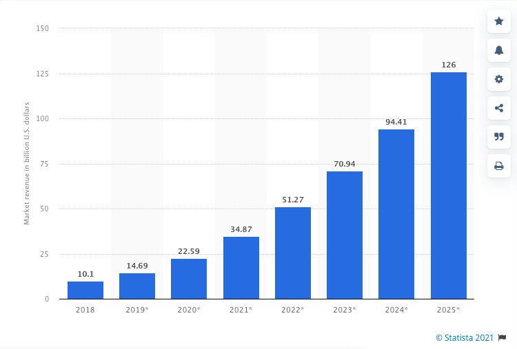

Since 2019 the market growth of AI has been increasing in a 39% uphill trend till today and it keeps growing! If you don't know what AI is, we are going to explain it to you in very simple words, A.I. stands for Artificial Intelligence and **the main goal of AI is to enable machines to perform activities and analysis near to (or even better than) human-level intelligence.

There are 4 types of AI:

1. **Reactive Machines:** reactive machines do not store memories or use past experiences to determine future actions. They just perceive the world and react to it. A popular example is: IBM's Deep Blue, a machine that beat chess Grandmaster Garry Kasparov in 1997.
2. **Limited Memory:** it’s the most common type of AI used today, and this AI learns from past experiences and builds experiential knowledge by observing action and data. For example, self-driving cars are limited memory AI, they make immediate decisions using data from the recent past.
3. **Theory of mind:** refers to a human’s ability to represent the mental states of others, such as their desires, beliefs, intentions, and so on. For example, “I’m hungry so I am going to grab that apple” the AI would understand “she must be hungry”.
4. **Self-awareness:** these are machines that are aware of themselves and know their internal states, most likely are able to empathize with human states of being and emotions. For example, the AI of the “Her” movie, where the main character develops a love bond with its AI.

In the words of Scott Bonneau -*“AI covers a vast range of use cases, from controlling the characters in your favorite video game to powering self-driving cars, and everything in between”*

The progress of AI market value according to [Statista:](https://www.statista.com/statistics/607716/worldwide-artificial-intelligence-market-revenues/)

**“Revenues from the AI software market from 2018 - 2025” [Statista](https://www.statista.com/statistics/607716/worldwide-artificial-intelligence-market-revenues/) (In Billions of U.S. dollars)**

During the COVID-19 pandemic, our market was forced to increase automation to maintain human isolation, many jobs were left to computers and machines, and the businesses that were already advanced into automation seized the opportunity to gain leverage over this scenario to massively grow within new demands and opportunities.

 

So, what are the big goals of this technology in today’s market? What are the plans of big companies' team labs? How will all of this impact us?

These are crucial questions, but let’s start with the basic, projects of tech companies in AI:

- **IBM:** this company is investing in technologies of rapid growth like the cloud, data, and artificial intelligence. Similar to Microsoft, IBM sees a high potential for AI in health care, developing products that aim to individualize care, and also the market of finance has been stimulated by the creation of products that will help with subjects such as compliance and customer experiences. IBM today’s annual revenue is estimated at $70 billion USD.
- **Microsoft:** the company cloud computing service, Azure, is home to a broad ecosystem of AI-driven tools for medicine, language, robotics, medical imaging, and many other areas! Microsoft’s annual revenue is estimated at $61 billion USD.
- **Amazon:** AI has been the constant point of growth for Amazon, starting with its golden AI product, Alexa, the leading product in customer speech recognition. Amazon’s AI success is also a proven case in the improvement of the core of its business: search relevance due to user preferences, products filter, and customer experience are key to their success and its estimated annual revenue is $221 billion USD.
- **Alphabet Google:** voice search, digital AD pricing, email spam filters, and relevant search results all use internally developed AI tools and deep learning techniques to drive the world’s most dominant search engine. Alphabet Google’s annual revenue is estimated at $183 billion USD.
- **Apple:** the hardware-software ecosystem that made Apple a technology empire is also planning to sharpen them with AI to make the ecosystem even more competitive. With its new team member Samy Bengio, a prominent Google AI expert, Apple is investing more and more in a new campus at the Research Area of North Carolina, the campus will house jobs in machine learning, AI, and Software engineering, generating at least 3,000 job openings! Apple’s annual revenue is estimated at $274 billion USD.

Most of these companies are investing big time in AI because they want to provide a more personalized experience of their products, and generate a deeper bond with their customers to forecast outcomes, make predictions and boost their revenues.

The hiring growth for AI jobs has been increasing 32% since 2019 according to LinkedIn, this percentage % can be translated to 97 million new job vacancies by 2025, according to The World Economic Forum.

So, what to do with all of this information? Don’t worry, we saved the best for the last (; here is a [CNBC list](https://www.cnbc.com/2021/06/01/10-of-the-most-in-demand-ai-jobs-that-pay-at-least-95000.html) of the top demanded jobs in AI along with its annual salary average, which one calls your attention the most?

1. Data Scientist - $110.000 USD
2. Senior Software Engineer - $120.000 USD
3. Machine Learning Engineer - $125.000 USD
4. Data Engineer - $122.050 USD
5. Software Engineer - $100.000 USD
6. Software Developer - $95.000 USD
7. Software Architect - $135,107 USD
8. Senior Data Scientist - $127,500 USD
9. Full Stack Developer - $108,730 USD
10. Principal Software Engineer - $155,000 USD

One thing we are certain of, the future will be all about AI, Software Devs, Cloud, and Data.

We at 4Geeks Academy are fully aware of these trends and have designed the most complete and robust AI course ever brought so that you can effectively and quickly upskill into the future of work and pursue a career in AI.

Our AI/ML program is a first-of-its-kind education curriculum that focuses on the practical skills and strategies needed to lead a successful career in AI development, management, and leadership. It will help you develop the necessary tools to upskill for the future of AI work.

If you are considering diving into the AI/ML engineering world, [click here](https://4geeksacademy.com/) to get to know more about our flexible Bootcamp programs.

[Subscribe to our newsletter](https://4geeksacademy.com/) for more updates about our programs, alumni, events, partners, and special recognitions 🤓 🖥