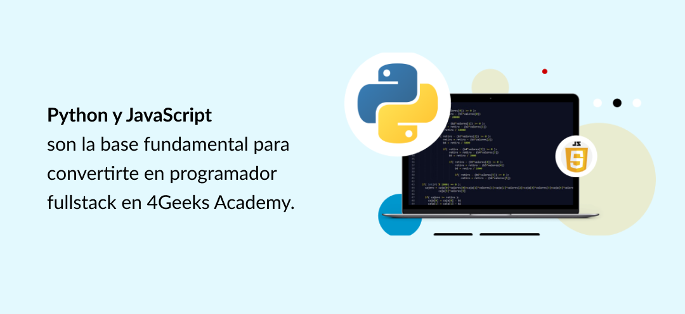

La idea de aprender a programar desde cero puede ser abrumadora. El conocimiento previo no es lo más importante para completar con éxito un curso de programación desde cero, ***lo más importante es la determinación de alcanzar el éxito.***

## Acerca del curso de programación  🖥️

Para convertirte en un full stack developer no hace falta experiencia, sino **tiempo y dedicación.** 

La dedicación que necesitarás para aprender a programar desde cero es la siguiente:

- **Para las [clases en vivo](https://4geeksacademy.com/es/coding-bootcamps/full-stack-part-time/):** 16 semanas, 3 veces a la semana
- **Fuera de horario de clases:** Todo el tiempo que necesites para completar los proyectos planteados en el curso de full stack developer.

Al culminar un curso como el de [4Geeks Academy](https://4geeksacademy.com/es/sobre-la-academia), tendrás [oportunidades de conseguir empleo](https://4geeksacademy.com/es/geekforce) en el sector de tecnología, podrás convertirte en programador freelance, entenderás mejor la programación para gestionar tu carrera actual o podrás lanzar tu emprendimiento del mundo tech.

## ¿Qué aprenderás en el curso? 💡

Para aprender a programar desde cero con caras al futuro, es importante desarrollar la lógica y entender cómo “piensa” una computadora, cómo “hablan”, cómo engranan y se entienden los elementos de una aplicación entre sí.  Normalmente, en un curso de programación desde cero se aprende sobre la parte técnica, pero no te enseñan a pensar y sobre todo, no te enseñan a aprender a aprender. ¡Así mismo! Aprender a aprender: la tecnología cambia a ritmos muy acelerados y si no aprendes a aprender, es probable que el conocimiento técnico se vuelva obsoleto en poco tiempo.

Desarrollar la habilidad de programar va de la mano con la creatividad y la búsqueda de soluciones a problemas.  Programar significa solucionar problemas a través de ciertas herramientas con las que se crean instrucciones para que situaciones o problemas sean resueltos de forma sistemática por un software.

En resumen, [en este curso](https://4geeksacademy.com/es/coding-bootcamps/full-stack-part-time) aprenderás una nueva forma de pensar. Desarrollarás una base sólida de front-end, back-end, base de datos, manejo de procesos distribuidos y despliegue a distintas plataformas web. Obtendrás las habilidades y conocimientos para crear un sitio web. Te  sumergirás en las mejores prácticas del diseño web responsivo y trabajarás con diversos lenguajes.

## ¿Qué significa ser full stack developer? 🧠

Un full stack developer es un desarrollador que domina la tecnología full-stack, tanto front-end como back-end. y  ¿Qué significa todo esto?

Entonces debes conocer estos términos:

### Stack 📚

La traducción de stack es “pila de cosas”, en este caso sería la pila completa de aplicaciones que se comunican entre entre sí, para que puedan ejecutar, en conjunto, una acción solicitada por el usuario/cliente.

### Front-end ➡️

Es todo lo que el usuario (o el lado del cliente) puede ver y con lo que puede interactuar.

### Back-end ⬅️

Es la arquitectura interna del sitio, es todo lo que ocurre del lado del servidor. No es visible al usuario pero es la parte que procesa la información que se recibe del front-end.

De esta manera, un full stack developer conoce toda la cadena de un sistema o aplicación. El trabajo de estos desarrolladores es lograr que los componentes de un sistema se comuniquen entre sí para lograr que un programa solucione el problema para el cual fue creado.

En un curso de programación web para [convertirte en full-stack developer](https://4geeksacademy.com/es/coding-bootcamps/full-stack-part-time), aprenderás sobre el front-end, el back-end, y lo que está en el medio, podemos decir que las APIs son parte de lo que está en el medio.

**Las APIs** son módulos que hacen posible que dos conjuntos de software distintos se comuniquen e interactúen entre sí.

Al culminar un curso de full stack developer estos términos no serán ajenos a ti y ¡Vivirás con ellos para crear cosas increíbles!

## Herramientas y lenguajes de programación que aprenderás 🧰

En nuestro curso de programación en línea para convertirte en desarrollador full-stack, aprenderás las herramientas fundamentales que rigen el front y el back end. Entre ellas:

### HTML5

HTML5 es la quinta versión de HTML. En términos generales, HTML, es el lenguaje que permite construir la estructura de una página web. HTML le dice al navegador cómo mostrar el contenido (imágenes y texto) de un website.

Aunque podemos decir que HTML es un lenguaje, no es un lenguaje de programación. La verdad es que hay lenguajes de programación, de scripting (secuencia de comandos) y de markup. HTML es un lenguaje de markup que se usa para darle forma a la información que se presenta en una vista del website.

HTML5 tiene varias ventajas que no aplican para HTML. Por ejemplo:

- HTML5 es más amigable para navegación en el celular
- HTML5 ayuda a crear páginas más dinámicas porque funciona con audio y video
- HTML5 tiene múltiples opciones de almacenamiento (no solo en el caché del navegador)
- HTML5 es más leniente con los errores de sintaxis en el código

Existen varias otras ventajas técnicas que aprenderás en el camino a convertirte en full stack developer en el curso online de [4Geeks Academy](https://4geeksacademy.com/es/sobre-la-academia).

### CSS

CSS describe cómo los elementos de HTML deben ser mostrados en la pantalla. CSS separa, distribuye contenido y da forma a la presentación del mismo en una página web. CSS es lo que permite que un website sea responsivo (que se adapte a cualquier pantalla), y además de esta propiedad tiene como beneficio que ayuda a definir el estilo de toda  la página -evita el trabajo de crear estilos página por página.

### JavaScript

JavaScript o JS, es un lenguaje de programación que ayuda a darle interactividad a una página web. Hace algunos años las páginas web eran planas, no ocurría mayor cosa, solo mostraban texto e imágenes y tenían hipervínculos que las entrelazaban con otras páginas. Pero JavaScript también es útil para el backend, ya que al usarlo con una herramienta como Node.JS se pueden crear, abrir, leer, escribir y borrar archivos en el servidor, así como obtener datos para almacenarlos en una base de datos.

En un curso para aprender programación desde cero, HTML, CSS y los fundamentos de JavaScript se enseñan generalmente al inicio ya que son la base para entender la creación de un website.

### Python

Python es uno de los lenguajes de programación más populares en la actualidad. Esto se debe a su sintaxis sencilla, por lo que es fácil de aprender.  Además, Python no fue creado para resolver un problema específico, por lo que tiene varias aplicaciones en el mundo real y eso lo hace muy versátil. Este programa es comúnmente usado para crear sitios web, para crear software, para realizar análisis de datos y para automatizar tareas. A diferencia de otros programas, Python requiere menos líneas de código para lograr ciertas tareas, lo cual permite flexibilidad y rapidez en el desarrollo de una aplicación.

### React.js

Es una librería JavaScript desarrollada por el equipo de tecnología de Facebook para desarrollar interfaces de usuario. En este contexto, librería es un archivo con instrucciones para agregarle funcionalidades y efectos a un website, pero se han ido agregando tantas cosas a React que ya podemos considerarlo un framework.  React funciona con componentes, los cuales son piezas independientes de interfaz de usuario. Éstos son independientes y pueden ser reutilizados para crear interfaces complejas. Desde su lanzamiento en 2013 se ha convertido hoy en día en una de las tecnologías front-end más utilizadas, y sigue en crecimiento en comparación con sus "pares" Angular y Vue. 

### DOM

El DOM (Modelo de Objetos de Documento) es la representación de datos de los objetos que componen la estructura y el contenido de un documento en la web, por lo tanto funciona como una interfaz que permite navegar por la estructura de documentos que genera el navegador, y a través de él se puede añadir, modificar, o eliminar elementos y contenido.

### SQL

Es el lenguaje estándar para la gestión de bases relacionales. SQL se usa para comunicarse con una base de datos. A través de SQL se puede obtener y actualizar información de una base de datos.

### Flask

Flask es un framework escrito en Python. Un framework, o un framework para aplicaciones web es un conjunto de librerías, funcionalidades y módulos ya creados que permiten que los desarrolladores escriban código sin preocuparse por detalles en la programación. Un framework permite el desarrollo ágil de aplicaciones.

### Otras herramientas que aprenderás en el curso ⚒️

En un curso de programación desde cero como el bootcamp de 4Geeks Academy, podrás aprender otras herramientas para desarrollar la habilidad a pensar como un full stack developer desde el día cero. Algunas de estas herramientas son:

- **Patrón MVC:** Es una pauta para organizar las partes de una aplicación. Este patrón divide la aplicación en tres grandes secciones: el modelo (estructura de los datos), la vista (cómo se muestra), y el controlador (la lógica). Además, MVC describe las relaciones que se dan entre estas tres grandes partes. El desarrollo de una aplicación que sigue este patrón MVC permite desacoplar las partes y trabajar en paralelo en cada sección sin que se afecten o bloqueen mutuamente.
- **Módulos JS y Bundling:** Cuando se aprende a programar desde cero, es recomendable aprender desde un inicio a pensar de forma estratégica respecto al desarrollo del código. Los buenos programadores dividen su código en módulos, es decir en secciones. Un buen módulo tiene una funcionalidad específica, bien definida, que permite reusar su contenido, modificarlo, o eliminarlo, sin tener que modificar completamente el sitio. Ahora, bundling es la concatenación de módulos, bundling se usa para evitar “incluir” muchos módulos por separado lo que enlentece el tiempo de carga de un website.

## ¿Qué incluye?

Para [convertirse en programador](https://4geeksacademy.com/es/coding-bootcamps/full-stack-part-time/) no sólo es necesario el conocimiento de herramientas y lenguajes, sino que también es importante contar con ayuda cuando tienes dudas, superar las frustraciones de aprender a programar y tener compañía en tu introducción en el mundo laboral como desarrollador Jr. En un curso de programación web tradicional recibirás la formación técnica, pero no necesariamente tendrás acceso a otros beneficios que te harán un full stack developer integral.

### **INSTRUCTORES CON CLASES EN VIVO**

Las clases en [4Geeks Academy](https://4geeksacademy.com/es/sobre-la-academia) son totalmente en vivo. Estar conectado con instructores y compañeros hace la experiencia más enriquecedora. En un curso de programación online no es común tener interacciones en vivo con instructores y compañeros de estudio, en 4Geeks Academy sí las tendrás.

### **TODAS LAS MENTORÍAS QUE NECESITAS**

En línea y en persona, por el resto de tu vida, incluso para aclarar dudas de tu código relacionadas a tu trabajo. Ajustamos las sesiones según tu calendario, te aseguramos que tienes la oportunidad de una mentoría constante siempre que la necesites.

### **TIEMPO DE RESPUESTA**

No te quedes atascado con tu código, [no te llevará más de 15 minutos](https://4geeksacademy.com/es/geeks-vs-otros) para que un instructor te ayude a través de alguno de los canales de nuestra comunidad.

### **PROPORCIÓN PROFESOR: ESTUDIANTE 1:5**

Encontrarás más profesores en 4Geeks que el promedio de la industria. Aprender a programar desde cero es trabajo duro, la curva de aprendizaje se acelera no sólo con el estudio individual, sino también con el [apoyo de instructores](https://4geeksacademy.com/es/geeks-vs-otros) que tengan el tiempo de atender de forma personalizada las consultas de los estudiantes.

### **ACCESO A PLATAFORMA DE LECCIONES, EJERCICIOS Y CANALES DE LA COMUNIDAD**

Al ser estudiante en [4Geeks Academy](https://4geeksacademy.com/es/sobre-la-academia)  tendrás acceso a la plataforma oficial de clases y pertenecerás a una comunidad formada exclusivamente por alumnos, graduados, instructores y personal de la academia listo para ayudar.

### **SOPORTE PROFESIONAL A LA MEDIDA**

Basado en cada oportunidad laboral, recibirás coaching en otras habilidades además de las relacionadas a programar.

Te ayudaremos a perfeccionar tu perfil profesional. [Contarás con la asesoría personalizada](https://4geeksacademy.com/es/geekforce) con nuestros expertos para mejorar tu CV, Linkedin, GitHub y Portafolio.

Realizaremos simulacros de entrevistas para evaluar tus fortalezas y debilidades para crear un perfil más fuerte antes de las entrevistas reales. Cada vez que tenga una entrevista, practicaremos el uso de diferentes tecnologías. Tenemos nuestro propio grupo de ejercicios autocalificados, por lo que puede practicar hasta que domine las habilidades para obtener el trabajo que desea.

## Próximas fechas

[Elige cuál es la mejor fecha](https://4geeksacademy.com/es/proximas-fechas) para empezar a transformar tu vida y aprender a programar desde cero.

## Precios y pagos

Existen varias formas y facilidades de pago para  convertirte en programador full stack. Conócelas en nuestra [sección de financiamiento](https://4geeksacademy.com/es/alumnos-y-proyectos).

## Conoce developers graduados de nuestro curso

Hasta 2021 son más de 2000 graduados de 4Geeks Academy, [conoce lo que han sido capaces de construir](https://4geeksacademy.com/es/alumnos-y-proyectos) tras 16 semanas de aprendizaje intensivo.