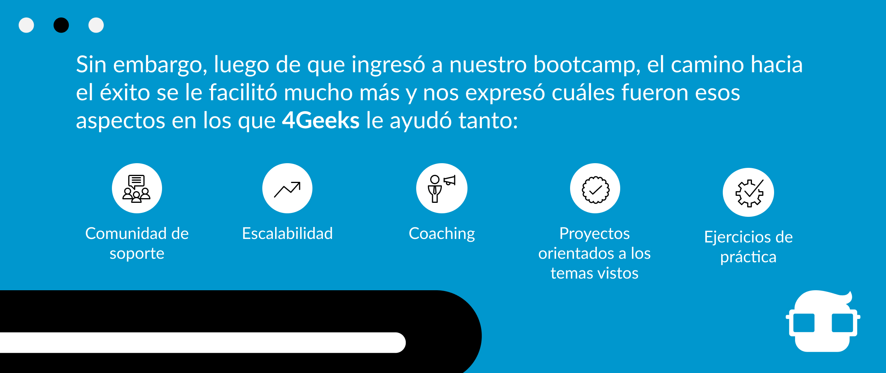

Por lo general, escuchamos que muchos recomiendan aprender a programar porque es la carrera del futuro, y lo primero que pensamos es: “Eso debe ser súper difícil” “¿Yo seré capaz de aprender eso tan complicado?” y no nos atrevemos ni siquiera a intentarlo. Siempre comenzar un camino nuevo va  a ser difícil, más, no imposible ¡Todo depende de ti!

Luego de conversaciones exhaustivas con nuestros egresados y programadores que aprendieron de forma autodidacta, pudimos recopilar información sobre los aspectos sencillos de la programación, los cuales lo leeremos a continuación:

## Facilidades

- Aprender pseudocódigo y paradigmas como programación orientada a objetos.
- Programar en otros lenguajes.
- Simplificar tareas.
- Aprender a programar el frontend y el backend. (No todos deciden convertirse en Full-Stack)
- Trabajar en las bases de datos.
- Aprendizaje a tu ritmo: puedes dedicarle las horas que necesitas a cada uno de los temas hasta que te sientas cómodo.

¿Ves que no todo es difícil?

Ahora bien, también sabemos que la programación tiene sus particularidades y sus partes complejas (como todo), así que hoy no solo vamos a hablarte de lo sencillo que puede ser programar, sino que también vamos a mostrarte el lado oscuro de la programación.

## Dificultades

- Adquirir la constancia de aprendizaje, y más si es a distancia.
- Siempre debes estar a la vanguardia, nunca dejas de aprender sobre distintas tecnologías, ¡Todo el tiempo hay una nueva!
- Implementar metodologías de trabajo adecuadas para cada proyecto ¡Siempre son distintos! (Lo comprobarán cuando empiecen en el área laboral).
- Comprender que con frecuencia, habrán cambios a última hora (y más si estás aprendiendo), para nosotros es difícil ser abiertos a los cambios.
- Evitar la procrastinación. ¿Les pasa igual?
- Aprender a manejar la frustración: es fácil sentirse frustrado en el proceso y más cuando no conoces muchos de los conceptos que debes aprender, programar no es un acto de la vida cotidiana, por lo que la terminología a utilizar es muy técnica y desconocida por muchos.

Uno de nuestros egresados del programa full-time nos comentó que él intentó aprender a programar de forma autodidacta, pero se encontró con muchas complicaciones, las cuales te comentaremos a continuación:

- No tener un camino definido: si estás comenzando en la programación, lo más seguro es que aún estés descubriendo qué quieres aprender y es realmente difícil saber, a ciencia cierta, qué es lo que vale la pena aprender en la etapa inicial.
- No tener feedback: a veces es necesario saber si lo que estás haciendo es la forma más adecuada. Cuando aprendes por tu cuenta, no tienes un feedback directo, estás a la deriva.
- Tiempo de aprendizaje prolongado, puede que el tiempo que tardes aprendiendo sea muy largo, ya sea por falta de organización o por frustración.
- Frustración: es fácil sentirse de esta manera, sobre todo, cuando te das cuenta de la cantidad de cosas que tienes que aprender por tu cuenta y más, cuando no estás seguro si lo que estás aprendiendo es realmente necesario en tu etapa de aprendizaje actual.
- Información errada: a veces puedes encontrar información que no necesariamente es precisa. Eso puede crear confusión porque la programación siempre va a variar dependiendo del problema que tengas presente.

- “Comunidad de soporte: Tienes a tus compañeros, a los profesores y a toda la comunidad de Slack a tu disposición, así, es posible resolver tus dudas de forma rápida.
- Escalabilidad: el método de aprendizaje permite avanzar rápido y aprender en poco tiempo.
- Coaching: el proceso de aprender a programar tiene sus altas y bajas y los profesores te ayudan en cada momento.
- Proyectos orientados a los temas vistos: para cada tema tienes proyectos que te ayudan a aplicar los conocimientos y estos son evaluados por un profesor que da el visto bueno.
- Ejercicios de práctica: tienes muchísimos ejercicios en todo el programa que permite poner manos a la obra de las cosas aprendidas en clase.”

Como podemos ver, si, efectivamente programar tiene sus partes complicadas, pero tampoco es algo imposible de aprender, Bryan, egresado de 4Geeks, nos comentó que con esfuerzo, tiempo y dedicación puedes convertirte en Full-Stack, tal cual como lo es él hoy en día.

¿Qué dices, te atreves a intentarlo?

It´s time to code!
