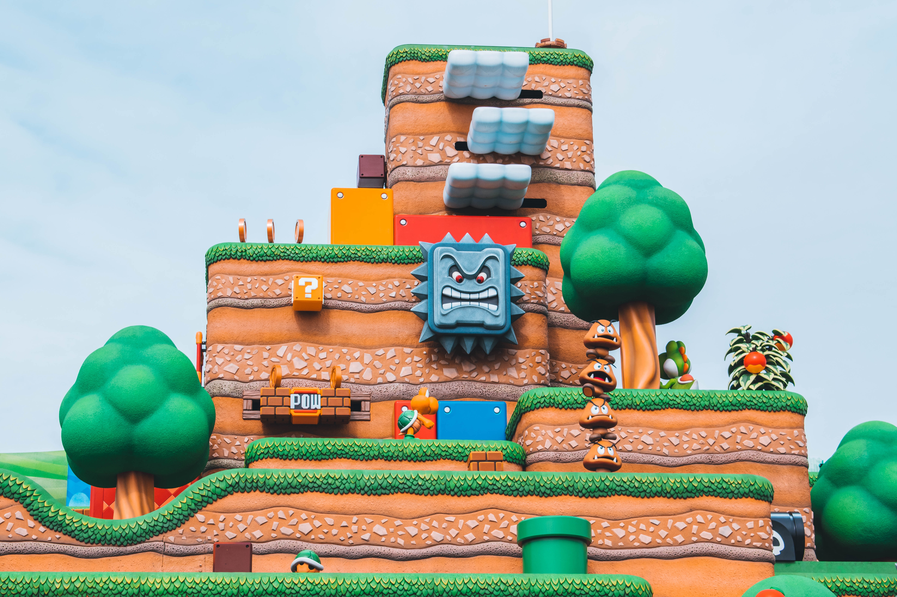
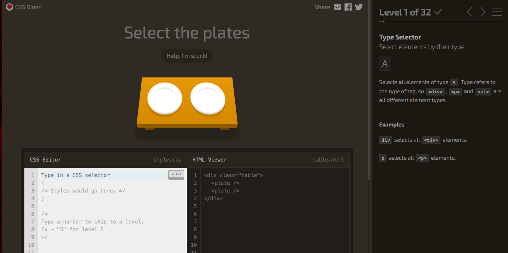
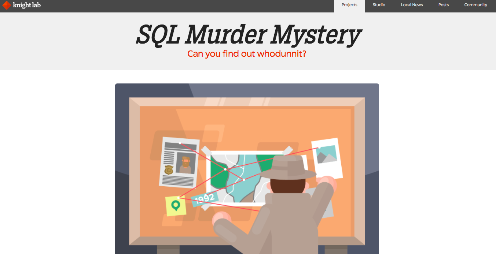
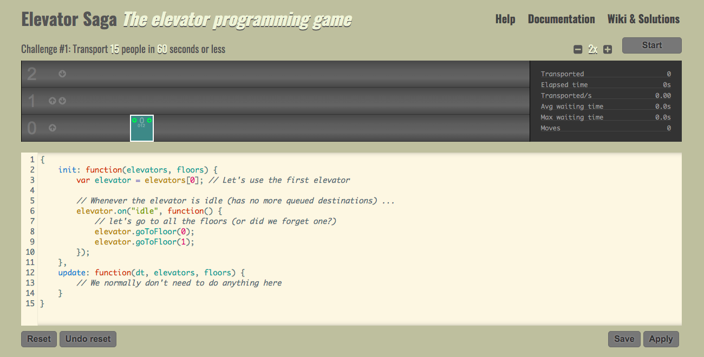
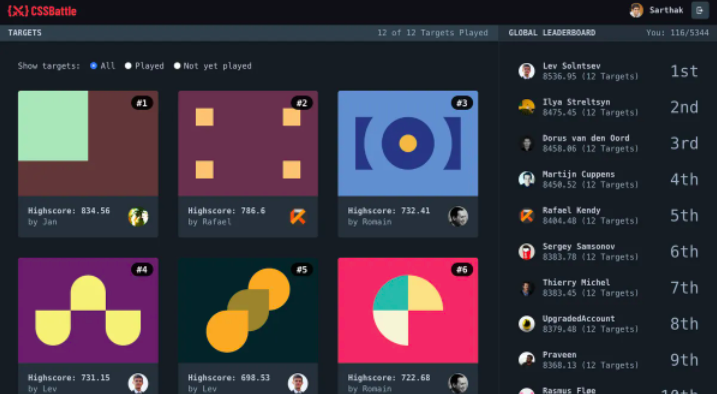
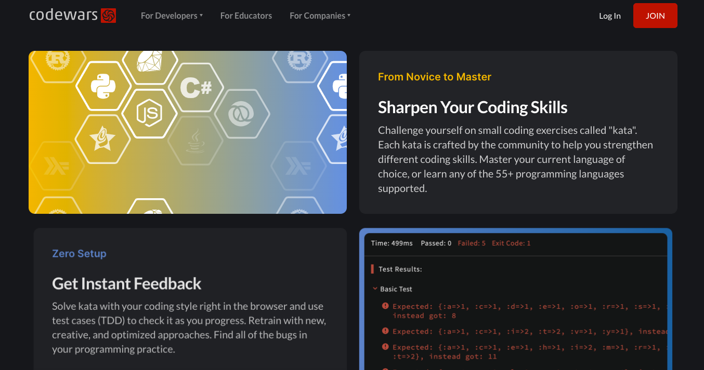

# Juegos gratis para practicar tus habilidades de programación

¿Cómo alimentar tu motivación al aprender a programar? sabemos que a pesar que nos gustaría que nuestro proceso de aprendizaje sea una línea recta ascendente↗️, a veces puede ser más como una montaña rusa🎢  afortunadamente tenemos algunos insights de experiencia para mantenerte motivado en tu camino.  

Uno de los aspectos más importantes al aprender a programar es la practica, debemos practicar mucho, sin embargo lo que pasa muchas veces es que las personas asocian estudiar con largas horas de lectura, desarrollar pasos técnicos enfrente de una computadora, realizar proyectos prácticos de clase, y por supuesto, todo eso es una parte del proceso de aprendizaje, pero después de cierto tiempo, todo esto se puede convertir en aburrimiento, nuestro cerebro se desconecta en algún punto, dejamos de encontrarle sentido, nos frustramos, y paramos. 😳  ¿te identificas?

Te recomendamos 2 cosas, diviértete en el proceso de aprendizaje, haz algo que realmente disfrutes como un proyecto personal o una actividad de ocio, y segundo, ponte metas sostenibles, es mejor comprometernos con 2 horas de practica diarias, a 6 horas diarias que al cabo de una semana nos harán sentir abrumados.

Una manera divertida de practicar tus hábilidades de programación es jugando algo llamado “coding games", estos juegos apuntan a resolver una meta en especifico usando como herramientas ciertos lenguajes de programación, como por ejemplo, Python, CSS, SQL, JavaScript, y más. Te gustaría saber más sobre ellos? 

Aquí te dejamos nuestro top 5 de juegos gratis en los que puedes practicar tus habilidades de programación: 

**1) [CSS Dinner:](https://flukeout.github.io/)** este es un juego en el que prácticamente estás aprendiendo y practicando cómo usar diferentes selectores de CSS, tiene 32 niveles diferentes, uno para casi todos los selectores que hay, y el objetivo es averiguar cómo seleccionar los elementos que están en la mesa, por ejemplo, en la imagen de abajo puedes ver dos platos blancos sobre la mesa, por lo que tienes que seleccionarlos correctamente.

 

**2) [SQL Murder Mystery:](https://mystery.knightlab.com/)** si te gustan los rompecabezas y los juegos de resolución de misterios, este te gustará mucho. SQL Murder Mystery es un juego en el que puedes aprender conceptos y comandos de SQL, y si ya tienes experiencia con SQL, es básicamente un divertido juego de misterio en el que usas múltiples “queries” para encontrar información de la escena del crimen y descubrir quién es el criminal. Si eres nuevo en SQL, este juego te dará el dominio que estás buscando.

**3) [Elevator Saga:](https://play.elevatorsaga.com/)** este juego, como su nombre lo indica, se trata de programar ascensores y funciona con JavaScript. Elevator saga te da diferentes retos y tu trabajo es programar un ascensor para transportar personas, para poder pasar los niveles tienes que transportar cierta cantidad de pasajeros en cierto tiempo. Es un juego basado en la eficiencia, para ver cuan eficiente estás transportando personas y qué tan rápido lo haces mientras crea scripts con JavaScript. 

**4) [CSS Battle:](https://cssbattle.dev/)** crea píxeles perfectos para replicar objetivos usando HTML y CSS. Lucha con jugadores de todo el mundo para llegar a lo más alto de la clasificación. Este juego es para principiantes, intermedios, e incluso expertos en CSS.

**5) [Code Wars:](https://www.codewars.com/)** desafíate a ti mismo con pequeños ejercicios llamados "kata". Cada kata está elaborado por la comunidad para ayudarlo a fortalecer diferentes habilidades de programación. Domina el idioma de tu elección, o aprende cualquiera de los más de 55 lenguajes de programación soportados en el juego. Python, JavaScript, y más.

Esperamos que disfrutes estos juegos tanto como nosotros, y te ayuden a fortalecer tus habilidades de programación. Si estás buscando iniciar una carrera como Full-Stack Software Developer o Machine Learning Engineer, nuestro Coding Bootcamp te ayudará a despegar en estos y otros lenguajes de programación, para conocer más sobre nuestros programas [haz click aquí.](https://4geeksacademy.com/)
